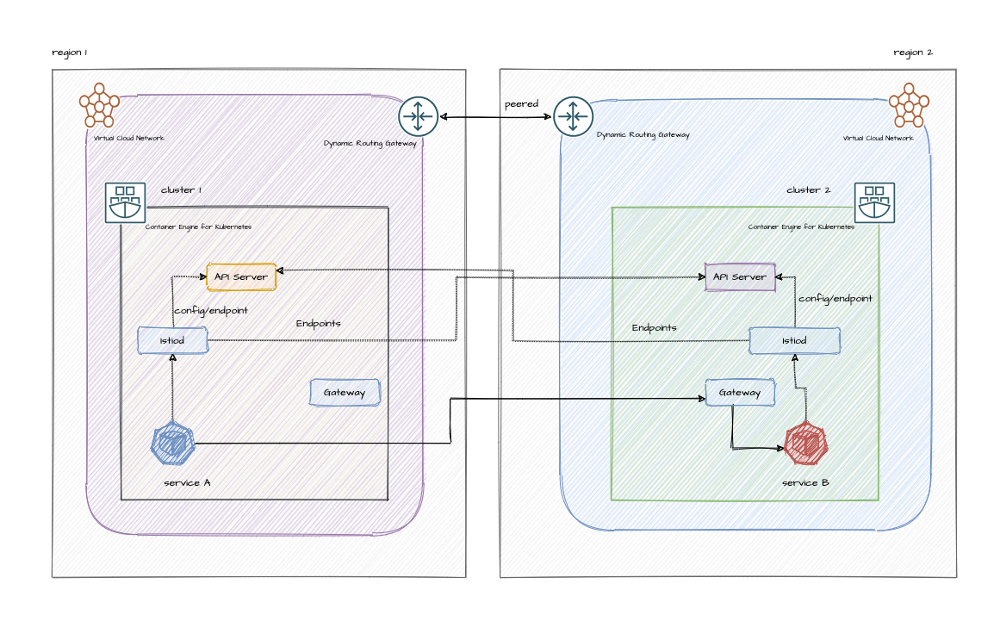

# Demo: Install Multi-Primary on different networks

Steps to orchestrate service mesh with [Istio](https://istio.io/) across two different OKE clusters.



## Prerequisites

For OCI cloud provider

-   Generate admin user api keys as per [OCI Docs](https://docs.oracle.com/en-us/iaas/Content/API/Concepts/apisigningkey.htm#two)
-   Capture the values for
    - user_id
    - tenancy_id
    - fingerprint
    - region
    - private_key
-   Create a customer secret key for storing terraform state in remote bucket as per [OCI Docs](https://docs.oracle.com/en-us/iaas/Content/Object/Tasks/s3compatibleapi.htm#usingAPI)
-   Capture the values for
    - s3 access key
    - s3 secret key
    - s3 region
    - s3 comptability api endpoint
-   Create bucket for storing terraform state files
    - capture the name of the bucket

## Create docker image
```
    git clone https://github.com/ddevadat/iac-devops.git
    cd control-center
    docker build -t control-center-iac-devops .

```